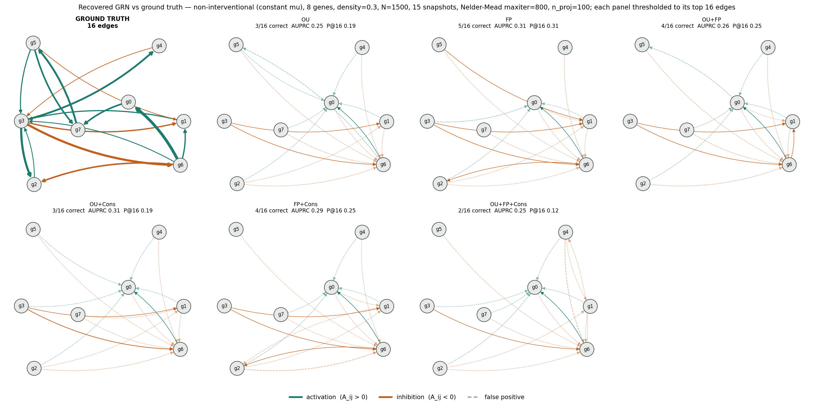
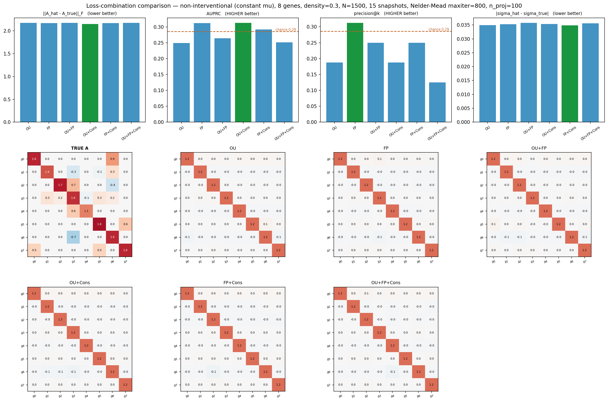

# Non-interventional run — 8 genes

`21-09-6-14-34-8` · commit `59d423d-dirty` · generated 2026-09-21 14:40

## What this run asks

Whether removing the intervention helps GRN recovery. The knockout runs scored at chance on every edge-detection metric; one explanation is that the intervention transient dominates the loss and buries the edge signal. Here mu is constant, so the network itself is the only thing moving the population.

## Dataset

Generated by `tests/diagnostics/non-interventional/_stationary_ground_truth.py` (constant mu, coupled A, perturbed start). Deterministic from `data_seed=42` — no data files are stored; rerun the command below to reproduce it exactly.

| | |
|---|---|
| genes | 8 |
| cells per snapshot | 1500 |
| snapshots | 15 |
| dt | 0.500 |
| total time T | 7.00 |
| true edges | 16 |
| possible edges | 56 |
| edge density (realised) | 0.286 |
| mean \|edge\| | 0.415 |
| max \|edge\| | 0.935 |
| sigma (noise) | 0.379 |
| edge / sigma | 1.09 |
| eig(A) real range | 1.05 .. 2.13 |
| stable (all Re>0) | True |
| oscillatory modes | True |
| slowest relax time | 0.949 |
| dt / slowest tau | 0.53 |


_Top-left_ UMAP over all snapshots, coloured by time. _Top-right_ population mean trajectory in PCA space, with the perturbed start and the mu target. _Bottom-left_ per-gene relaxation, dotted lines are mu. _Bottom-right_ the true A being recovered.

## Config

| | |
|---|---|
| n_genes | 8 |
| n_cells | 1500 |
| n_snaps | 15 |
| dt | 0.5 |
| density | 0.3 |
| data_seed | 42 |
| fit_seed | 0 |
| n_proj | 100 |
| maxiter | 800 |
| optimizer | Nelder-Mead |

## Results

**No combination beats chance.** The AUPRC baseline here is 0.286 (the fraction of candidate pairs that are real edges) and every combination lands within 0.05 of it, as does AUROC of 0.5. Edge recovery is not working on this dataset either.

| combination | A_err | offdiag_err | edge_corr | auprc | auroc | precision_at_k | recall_at_k | sigma_err | final_objective | n_evals | seconds |
|---|---:|---:|---:|---:|---:|---:|---:|---:|---:|---:|---:|
| OU | 2.1736 | 1.8555 | 0.2780 | 0.2490 | 0.4141 | 0.1875 | 0.1875 | 0.0349 | 0.0949 | 1172 | 122.8000 |
| FP | 2.1701 | 1.8529 | 0.2976 | 0.3122 | 0.4844 | 0.3125 | 0.3125 | 0.0353 | 0.1071 | 1167 | 129.6000 |
| OU+FP | 2.1735 | 1.8569 | 0.2775 | 0.2642 | 0.4672 | 0.2500 | 0.2500 | 0.0358 | 0.2055 | 1165 | 244.3000 |
| OU+Cons | 2.1508 | 1.8292 | 0.3973 | 0.3128 | 0.4219 | 0.1875 | 0.1875 | 0.0353 | 0.1023 | 1168 | 246.2000 |
| FP+Cons | 2.1715 | 1.8541 | 0.2921 | 0.2919 | 0.4688 | 0.2500 | 0.2500 | 0.0349 | 0.1134 | 1170 | 253.5000 |
| OU+FP+Cons | 2.1749 | 1.8578 | 0.2717 | 0.2514 | 0.4219 | 0.1250 | 0.1250 | 0.0356 | 0.2113 | 1164 | 362.9000 |

**Baselines.** AUPRC and precision@16 both have a chance level of 0.286 (= 16 true edges / 56 candidate pairs); AUROC's is 0.500 by construction. Compare every row against those, not against each other.



Recovered networks vs ground truth, each thresholded to its top 16 edges. Solid = correctly recovered, dashed and pale = false positive.



## Files

| file | contents |
|---|---|
| `dataset.png` | dataset overview |
| `results.csv` | metrics per loss combination |
| `grn_networks.png` | recovered GRNs vs truth |
| `metrics_and_matrices.png` | metric bars + recovered A heatmaps |
| `recovered_matrices.npz` | fitted A and sigma, for reanalysis without refitting |

## Reproduce

```bash
GRN_N_GENES=8 GRN_N_CELLS=1500 GRN_N_SNAPS=15 GRN_DT=0.5 GRN_NETWORK_DENSITY=0.3 GRN_DATA_SEED=42 GRN_N_PROJ=100 GRN_MAXITER=800 \
  uv run python tests/diagnostics/non-interventional/compare_losses_stationary.py --jobs 6
```
