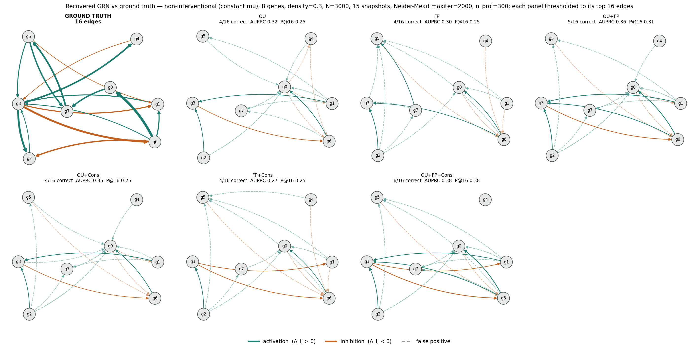
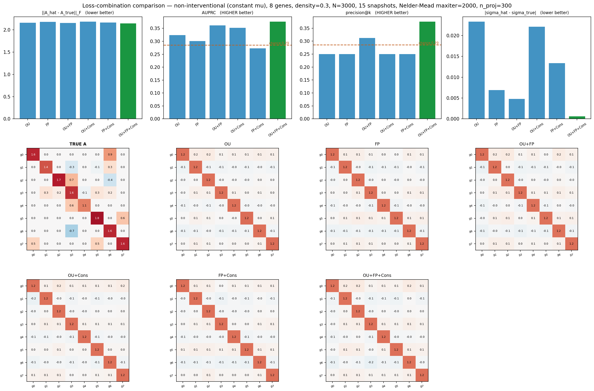

# Non-interventional run — 8 genes

`21-09-6-16-40-8` · commit `59d423d-dirty` · generated 2026-09-21 22:27

## What this run asks

Whether removing the intervention helps GRN recovery. The knockout runs scored at chance on every edge-detection metric; one explanation is that the intervention transient dominates the loss and buries the edge signal. Here mu is constant, so the network itself is the only thing moving the population.

## Dataset

Generated by `tests/diagnostics/non-interventional/_stationary_ground_truth.py` (constant mu, coupled A, perturbed start). Deterministic from `data_seed=42` — no data files are stored; rerun the command below to reproduce it exactly.

| | |
|---|---|
| genes | 8 |
| cells per snapshot | 3000 |
| snapshots | 15 |
| dt | 0.500 |
| total time T | 7.00 |
| true edges | 16 |
| possible edges | 56 |
| edge density (realised) | 0.286 |
| mean \|edge\| | 0.415 |
| max \|edge\| | 0.935 |
| sigma (noise) | 0.379 |
| edge / sigma | 1.09 |
| eig(A) real range | 1.05 .. 2.13 |
| stable (all Re>0) | True |
| oscillatory modes | True |
| slowest relax time | 0.949 |
| dt / slowest tau | 0.53 |


_Top-left_ UMAP over all snapshots, coloured by time. _Top-right_ population mean trajectory in PCA space, with the perturbed start and the mu target. _Bottom-left_ per-gene relaxation, dotted lines are mu. _Bottom-right_ the true A being recovered.

## Config

| | |
|---|---|
| n_genes | 8 |
| n_cells | 3000 |
| n_snaps | 15 |
| dt | 0.5 |
| density | 0.3 |
| data_seed | 42 |
| fit_seed | 0 |
| n_proj | 300 |
| maxiter | 2000 |
| optimizer | Nelder-Mead |

## Results

**3 of 6 combinations** score more than 0.05 above the chance baseline of 0.286 on AUPRC. Best: **OU+FP+Cons** at 0.376.

| combination | A_err | offdiag_err | edge_corr | auprc | auroc | precision_at_k | recall_at_k | sigma_err | final_objective | n_evals | seconds |
|---|---:|---:|---:|---:|---:|---:|---:|---:|---:|---:|---:|
| OU | 2.1594 | 1.8152 | 0.2646 | 0.3240 | 0.5531 | 0.2500 | 0.2500 | 0.0233 | 0.1235 | 2378 | 1569.5000 |
| FP | 2.1784 | 1.8317 | 0.2293 | 0.3005 | 0.4938 | 0.2500 | 0.2500 | 0.0069 | 0.1171 | 2556 | 1803.0000 |
| OU+FP | 2.1564 | 1.7910 | 0.2906 | 0.3617 | 0.5672 | 0.3125 | 0.3125 | 0.0048 | 0.1979 | 2458 | 3221.2000 |
| OU+Cons | 2.1831 | 1.8325 | 0.2212 | 0.3521 | 0.6062 | 0.2500 | 0.2500 | 0.0221 | 0.1174 | 2495 | 3273.6000 |
| FP+Cons | 2.1650 | 1.8202 | 0.2554 | 0.2723 | 0.4609 | 0.2500 | 0.2500 | 0.0134 | 0.1265 | 2417 | 3203.2000 |
| OU+FP+Cons | 2.1440 | 1.7767 | 0.3122 | 0.3758 | 0.6078 | 0.3750 | 0.3750 | 0.0006 | 0.2000 | 2459 | 4692.2000 |

**Baselines.** AUPRC and precision@16 both have a chance level of 0.286 (= 16 true edges / 56 candidate pairs); AUROC's is 0.500 by construction. Compare every row against those, not against each other.



Recovered networks vs ground truth, each thresholded to its top 16 edges. Solid = correctly recovered, dashed and pale = false positive.



## Files

| file | contents |
|---|---|
| `dataset.png` | dataset overview |
| `results.csv` | metrics per loss combination |
| `grn_networks.png` | recovered GRNs vs truth |
| `metrics_and_matrices.png` | metric bars + recovered A heatmaps |
| `recovered_matrices.npz` | fitted A and sigma, for reanalysis without refitting |

## Reproduce

```bash
GRN_N_GENES=8 GRN_N_CELLS=3000 GRN_N_SNAPS=15 GRN_DT=0.5 GRN_NETWORK_DENSITY=0.3 GRN_DATA_SEED=42 GRN_N_PROJ=300 GRN_MAXITER=2000 \
  uv run python tests/diagnostics/non-interventional/compare_losses_stationary.py --jobs 6
```
