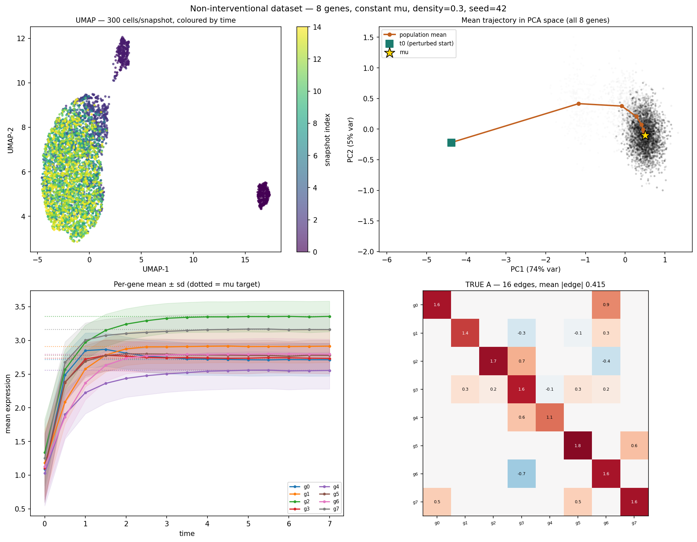
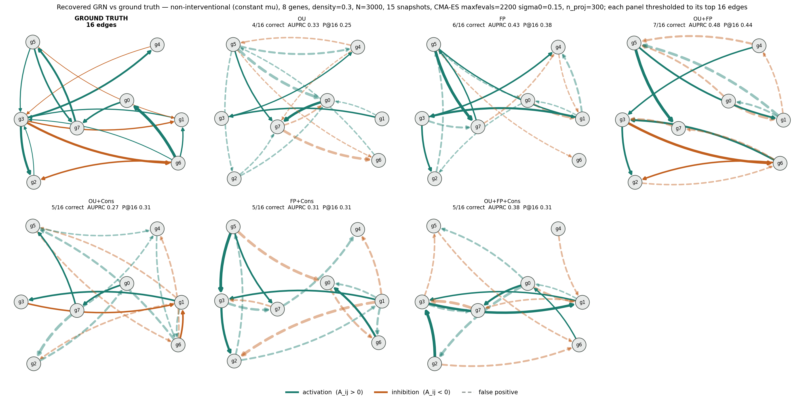
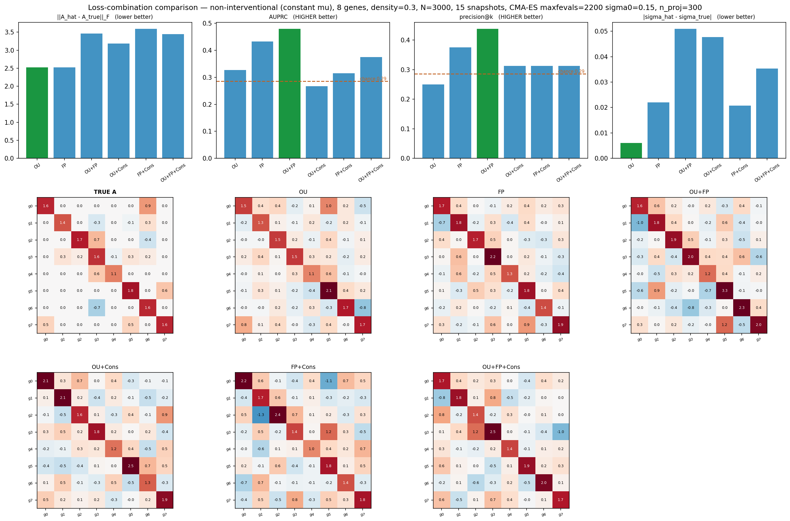

# Non-interventional run — 8 genes

`22-09-6-11-28-8` · commit `59d423d-dirty` · generated 2026-09-22 12:55

## What this run asks

Whether removing the intervention helps GRN recovery. The knockout runs scored at chance on every edge-detection metric; one explanation is that the intervention transient dominates the loss and buries the edge signal. Here mu is constant, so the network itself is the only thing moving the population.

## Dataset

Generated by `tests/diagnostics/non-interventional/_stationary_ground_truth.py` (constant mu, coupled A, perturbed start). Deterministic from `data_seed=42` — no data files are stored; rerun the command below to reproduce it exactly.

| | |
|---|---|
| genes | 8 |
| cells per snapshot | 3000 |
| snapshots | 15 |
| dt | 0.500 |
| total time T | 7.00 |
| true edges | 16 |
| possible edges | 56 |
| edge density (realised) | 0.286 |
| mean \|edge\| | 0.415 |
| max \|edge\| | 0.935 |
| sigma (noise) | 0.379 |
| edge / sigma | 1.09 |
| eig(A) real range | 1.05 .. 2.13 |
| stable (all Re>0) | True |
| oscillatory modes | True |
| slowest relax time | 0.949 |
| dt / slowest tau | 0.53 |



_Top-left_ UMAP over all snapshots, coloured by time. _Top-right_ population mean trajectory in PCA space, with the perturbed start and the mu target. _Bottom-left_ per-gene relaxation, dotted lines are mu. _Bottom-right_ the true A being recovered.

## Config

| | |
|---|---|
| n_genes | 8 |
| n_cells | 3000 |
| n_snaps | 15 |
| dt | 0.5 |
| density | 0.3 |
| data_seed | 42 |
| fit_seed | 0 |
| n_proj | 300 |
| maxfevals | 2200 |
| sigma0 | 0.15 |
| optimizer | CMA-ES |

## Results

**3 of 6 combinations** score more than 0.05 above the chance baseline of 0.286 on AUPRC. Best: **OU+FP** at 0.479.

| combination | A_err | offdiag_err | edge_corr | auprc | auroc | precision_at_k | recall_at_k | sigma_err | final_objective | n_evals | seconds |
|---|---:|---:|---:|---:|---:|---:|---:|---:|---:|---:|---:|
| OU | 2.5254 | 2.4866 | 0.3148 | 0.3275 | 0.5828 | 0.2500 | 0.2500 | 0.0061 | 0.0068 | 2209 | 1363.8000 |
| FP | 2.5270 | 2.3619 | 0.3909 | 0.4330 | 0.6016 | 0.3750 | 0.3750 | 0.0220 | 0.0057 | 2209 | 1387.5000 |
| OU+FP | 3.4625 | 2.9320 | 0.4066 | 0.4791 | 0.7031 | 0.4375 | 0.4375 | 0.0509 | 0.0162 | 2209 | 2797.2000 |
| OU+Cons | 3.1860 | 2.9143 | 0.1849 | 0.2667 | 0.4047 | 0.3125 | 0.3125 | 0.0477 | 0.0111 | 2209 | 2805.1000 |
| FP+Cons | 3.5903 | 3.4386 | 0.3123 | 0.3146 | 0.4984 | 0.3125 | 0.3125 | 0.0208 | 0.0111 | 2209 | 2830.7000 |
| OU+FP+Cons | 3.4492 | 3.2289 | 0.1350 | 0.3750 | 0.5406 | 0.3125 | 0.3125 | 0.0354 | 0.0182 | 2209 | 4074.3000 |

**Baselines.** AUPRC and precision@16 both have a chance level of 0.286 (= 16 true edges / 56 candidate pairs); AUROC's is 0.500 by construction. Compare every row against those, not against each other.



Recovered networks vs ground truth, each thresholded to its top 16 edges. Solid = correctly recovered, dashed and pale = false positive.



## Files

| file | contents |
|---|---|
| `dataset.png` | dataset overview |
| `results.csv` | metrics per loss combination |
| `grn_networks.png` | recovered GRNs vs truth |
| `metrics_and_matrices.png` | metric bars + recovered A heatmaps |
| `recovered_matrices.npz` | fitted A and sigma, for reanalysis without refitting |

## Reproduce

```bash
GRN_N_GENES=8 GRN_N_CELLS=3000 GRN_N_SNAPS=15 GRN_DT=0.5 GRN_NETWORK_DENSITY=0.3 GRN_DATA_SEED=42 GRN_N_PROJ=300 GRN_MAXFEVALS=2200 GRN_SIGMA0=0.15 \
  uv run python tests/diagnostics/non-interventional/compare_losses_stationary.py --jobs 6
```
